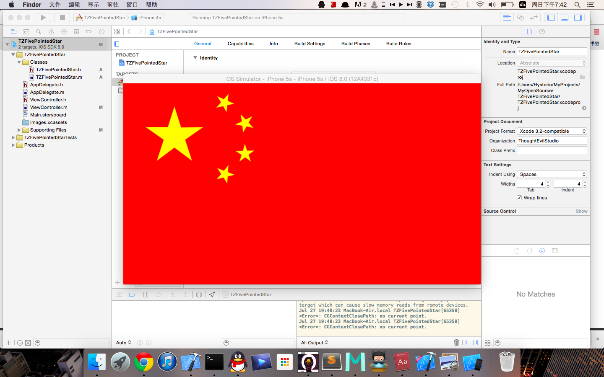

#TZFivePointedStar

This is a funny class help you to draw five-pointed star. You may like it if you are as bored as me. And I wrote an Example which draws a standard national flag of People's Republic of China with it. Yeah, I know I am bored.

##ScreenShot

